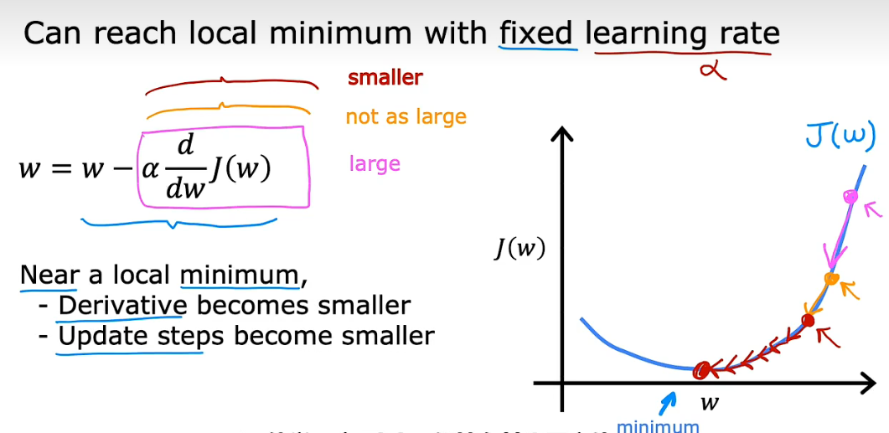

# Machine Learning

## 1 机器学习分类
### 1.1 Supervised Learning
拟合input和output，从而根据input预测output
1. Regression 回归: 从无限多可能的输出中预测输出
2. Classification: 预测分类，有限输出
### 1.2 Unsupervised Learning
数据没有明确的label，并不需要进行预测
1. Clustering 聚类：比如“相关推荐”，通过将没有label的数据，即在没有人指导的情况下根据特征进行分组（grouping them into clusters）
2. Anomaly Detection 异常检测：检测异常事件
3. Dimensionality Reduction 降维：压缩极大的数据集

## 2 Linear Regression
### 2.1 Training set: 
Notation:
1. x = "input" variable = feature
2. y = "output" variable = target
3. m = number of training examples
4. (x,y) = single training examples
5. $(x^{(i)},y^{(i)})$ = i^th^ training example
### 2.2 Univariate Linear Regression
Linear Regression with one variable:
$$
f_{w,b}(x)=wx+b=\widehat{y}
$$
- parameters/coefficient/weight: w.b
- slope 斜率
- intercept 截距
### 2.3 Cost Function
Squared error cost function:
$$
J(w,b)=\frac{1}{2m}\sum_{i=1}^m (\widehat{y}^{(i)} - y^{(i)})^2
$$
- 可视化代价函数：利用contour plots等高线图，w，b为x，y轴，J(w,b)为z轴
### 2.4 Linear Regression中的Gradient Descent
$\begin{gathered}
f_{w,b}(x^{(i)})=wx^{(i)}+b=\widehat{y}^{(i)}\\
J(w,b)=\frac{1}{2m}\sum_{i=1}^m (\widehat{y}^{(i)} - y^{(i)})^2\\
w=w-\alpha \frac{\partial J(w,b)}{\partial {w}}\\
b=b-\alpha \frac{\partial J(w,b)}{\partial {b}}\\
\end{gathered}$

代入：复合函数求偏导

$$
\begin{aligned}
w &= w-\alpha \frac{\partial J(w,b)}{\partial {w}}\\
&= w-\alpha \frac{1}{2m}\sum_{i=1}^m (\widehat{y}^{(i)} - y^{(i)})*2\frac{\partial \widehat{y}^{(i)}}{\partial w} \\
&= w-\alpha \frac{1}{m}\sum_{i=1}^m [(\widehat{y}^{(i)}-y^{(i)})*x^{(i)}]\\
\end{aligned}
$$
$$
\begin{aligned}
b&=b-\alpha \frac{\partial J(w,b)}{\partial {b}}\\
&=b-\alpha \frac{1}{2m}\sum_{i=1}^m (\widehat{y}^{(i)} - y^{(i)})*2\frac{\partial \widehat{y}^{(i)}}{\partial b}\\
&= b-\alpha \frac{1}{m}\sum_{i=1}^m (\widehat{y}^{(i)}-y^{(i)})
\end{aligned}
$$

## 3 Gradient Descent 梯度下降
作用：求local minimum
Simultaneous update of w and b:
$$
\begin{aligned}
& tmp\_w=w-\alpha \frac{\partial J(w,b)}{\partial {w}}\\
& tmp\_b=b-\alpha \frac{\partial J(w,b)}{\partial {b}}\\
& w=tmp\_w\\
& b=tmp\_b\\
\end{aligned}
$$

### 3.1 Learning Rate:$\alpha$
取值：(0,1)
如果太小，gradient descent算法执行效率低
如果太大，找不大minimum

让w无限趋近local minimum的自变量取值：

- 通过绘制$J(\vec{w},b)$关于iterations的函数判断$\alpha$取值是否合适

### 3.2 分类
1. Batch：每轮计算都用到所有样本，适用于小样本

## 4 Multiple Features
### 4.1 multiple variables

1. $x_j$：第j个fecture
2. $\vec{x}^{(i)}$：features of $i^{th}$ training example 行向量
&emsp;&emsp;$\vec{x}^{(2)}=[1416\ 3\ 2\ 40\ ...]$
3. $\vec{x}{_j}{^{(i)}}$：value of feature j in $i^{th}$ training example
&emsp;&emsp;$\vec{x}{_3}{^{(2)}}=2$
### 4.2 Multiple linear regression
$$
\begin{aligned}
f_{\vec{w},b}(\vec{x})& =w_1x_1+w_2x_2+...+w_nx_n+b\\
& =\vec{w}·\vec{x}+b
\end{aligned}
$$
### 4.3 Vectorization
使用NumPy库
~~~py
w = np.array([1.0,2.5,-3.3])
b = 4
x = np.array([10.20.30])
f = np.dot(w,x) + b
~~~
同时对向量中的每一项进行计算
### 4.4 多元线性的梯度下降
对于n features:
$$
\begin{aligned}
j = 1,2,...,n\\
& w_j = w_j-\alpha \frac{1}{m}\sum_{i=1}^m [(f_{\vec{w},b}(\vec{x}^{(i)})-y^{(i)})*x{_j}{^{(i)}}]\\
& b=b-\alpha \frac{1}{m}\sum_{i=1}^m (f_{\vec{w},b}(\vec{x}^{(i)})-y^{(i)})
\end{aligned}
$$
simultaneously update w_j(for j=1,...,n) and b

- Normal equation
  - 只能用于线性回归求解w和b，不通过iteration
  - 当feature很多时，求解慢
  - 一般用于machine learning libraries

### 4.5 Feature Scaling
1. 通过对特征进行缩放，改变特征的取值，使特征分布均匀（范围区间不能太大也不能太小，且特征的取值也不能太大或太小），从而便于梯度下降

2. 实现：
   - 除以最大值，获得
   - Mean Normalization：求平均，x-平均值/最大值-最小值
   - Z-score Normalization: 求平均值，x-平均值/标准差

### 4.6 Feature Engineering
通过transforming或combining原始特征，获得新的特征

## 5 Classification
### 5.1 Binary Classification
no & yes-negative class & positive class
### 5.2 Sigmoid/logistic function
$$
g(z) = \frac{1}{(1+e^{-z})}\\
0<g(z)<1
$$
#### Logistic Regression
$$
\begin{aligned}
f_{\vec{w},b}(\vec{x})&=g(\vec{w}·\vec{x}+b)\\
& =\frac{1}{(1+e^{-(\vec{w}·\vec{x}+b)})}\\
\end{aligned}
$$
$f_{\vec{w},b}(\vec{x})$为输出为1的概率，因而当$f_{\vec{w},b}(\vec{x})>=0.5,即g(z)>=0.5，即z=\vec{w}·\vec{x}+b>=0$时，$\hat{y}=1$

- 计算$\vec{w}$ $b$
  区别于线性回归，逻辑回归方程的代价函数$J(\vec{w},b)$non-convex，有多个局部最小值
#### Decision Boundary
$$
z=\vec{w}·\vec{x}+b=0
$$
用于预测，Decision Boundary内部为$\hat{y}=1$
- Non-linear decision boundaries:根据数据分布确定x的幂次